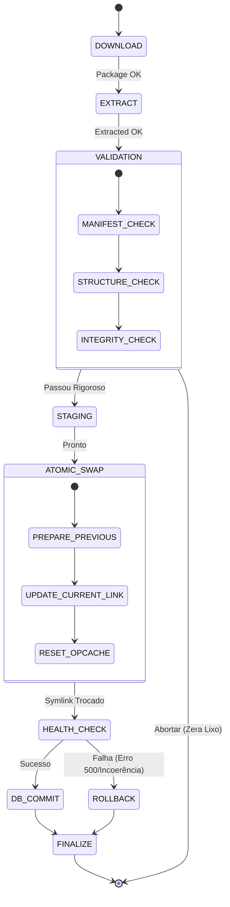

# 🏛️ Blueprint Oficial: SGIM OTA v2.0 (Release-Based Atomic Deploy)

## 1. Visão Geral da Arquitetura (Release-Based)
O sistema deixa de ser uma pasta estática (`public_html` ou `sgim-iade`) que sofre mutações, e passa a ser uma **casca apontadora** (Router/Symlink) que direciona o tráfego para versões isoladas e imutáveis.

### Estrutura de Diretórios
```text
/ (Raiz da Hospedagem)
│
├── releases/                  # Cofre de Versões Imutáveis
│   ├── v1.1.45/               # Versão Física 1 (Anterior)
│   ├── v1.1.46/               # Versão Física 2 (Nova)
│   ├── current                # SYMLINK -> aponta para v1.1.46
│   └── previous               # SYMLINK -> aponta para v1.1.45
│
├── shared/                    # Dados Mutáveis (Sobrevivem aos deploys)
│   ├── database/
│   ├── uploads/
│   └── logs/
│
└── sgim-iade                  # SYMLINK -> aponta para releases/current
    (Raiz Web Pública)
```

---

## 2. Diagrama de Estados do Pipeline


---

## 3. O Fluxo de Promoção Atômica (O Coração do Sistema)
Em vez de 1.000 operações `copy()`, teremos **3 operações instantâneas (~0.2ms totais)**:

1.  **Geração do Alvo**: A nova versão (v1.1.46) está íntegra em `releases/v1.1.46/`.
2.  **Atualização de Ponteiros**:
    *   `symlink('releases/current', 'releases/previous')` (Guarda quem era o atual)
    *   `symlink('releases/v1.1.46', 'releases/current_tmp')` (Cria novo link)
    *   `rename('releases/current_tmp', 'releases/current')` (Swap Atômico Posix)
3.  **Resultado**: Nenhum arquivo físico foi movido. O servidor apenas "virou a chave" apontando para a nova pasta. Se houvesse 100 mil arquivos, o tempo seria o mesmo: 0.07ms.

---

## 4. O Modelo de Health Check (Validação Pré-Commit)
Após o Atomic Swap, o sistema físico já é a v1.1.46. Mas o banco ainda diz v1.1.45.
Neste milissegundo de diferença, o `OtaOrchestrator` executa um autoteste:
*   Faz um request local para `http://seu-dominio.com/sgim-iade/api/health/version.php`.
*   Este arquivo (que faz parte da v1.1.46) deve responder com HTTP 200 e um JSON: `{"version": "1.1.46", "status": "operational"}`.
*   **Decisão**: Se o JSON bater, o código no banco é atualizado (`DB_COMMIT`). Se der erro 500 ou timeout, o sistema aciona o Rollback.

---

## 5. Estratégia de Rollback Transacional
O Rollback deixa de ser uma cópia reversa e vira um **Swap Reverso**.
Se o Health Check falhar (ou se o admin apertar "Reverter"):
1.  `rename('releases/previous', 'releases/current_tmp')`
2.  `rename('releases/current_tmp', 'releases/current')`
3.  `opcache_reset()`
4.  O sistema volta instantaneamente para a versão anterior. Tempo total de downtime: ZERO.

---

## 6. Comportamento Operacional de Resiliência

### Estratégia de Recovery Pós-Timeout
*   **Problema**: E se o servidor desligar durante o download ou extração?
*   **Solução**: O estado fica gravado como `PENDING`. Na próxima tentativa, o sistema ignora a pasta temporária pela metade, exclui o lixo, e recomeça. Nenhuma página pública é afetada porque o `current` não foi alterado.

### Estratégia Anti-Lock Residual
*   **Problema**: Locks de arquivos presos por processos fantasmas.
*   **Solução**: Como estamos escrevendo em uma pasta NOVA e VAZIA (`v1.1.46`), não há conflito de lock com o tráfego atual (que está lendo a v1.1.45). O swap de symlink ignora locks de arquivos individuais.

### Contingência Extrema (Maintenance Lock Sync)
Se, por alguma limitação arcana do cPanel/HostGator, a leitura de Symlinks for bloqueada via Apache (`Options -FollowSymLinks`):
*   O sistema detecta isso na validação do Staging.
*   Aciona o Fallback: Cria o arquivo `.maintenance` (derruba o site elegantemente com tela 503).
*   Faz a renomeação atômica das pastas físicas (Renomeia a atual para `_old`, e a nova para o nome oficial).
*   Remove o `.maintenance`.
*   Ainda atômico, mas com ~1 segundo de downtime explícito. NUNCA `copy()` arquivo por arquivo.

---

## 7. O Contrato de Publicação do Master
Para que isso funcione, o Master assina um contrato arquitetural estrito:
*   Sem `SGIM-CLIENTE` embutido.
*   Sem caminhos relativos variáveis.
*   O ZIP deve descompactar exata e unicamente a estrutura final da aplicação.
*   Presença obrigatória de `api/health/version.php`. Se o Master esquecer este arquivo, o pacote é rejeitado sumariamente pelo Cliente.
